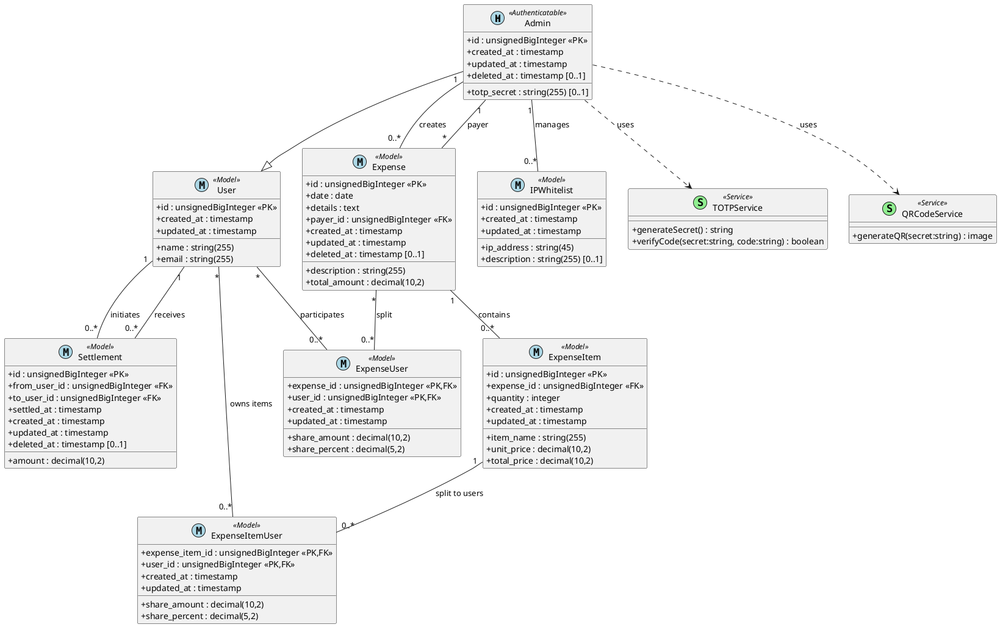

# PaySay - Expense Sharing System

PaySay is a Laravel-based expense tracking and settlement system tailored for small teams or office groups who share daily costs, like meals. The system handles expense entries, user shares, settlements, and authentication through secure OTP.

---

## Table of Contents
- [Overview](#overview)
- [Features](#features)
- [System Architecture](#system-architecture)
- [PlantUML Diagram](#plantuml-diagram)
- [Models & Migrations](#models--migrations)
- [Installation](#installation)
- [Usage](#usage)
- [License](#license)

---

## Overview
PaySay allows office colleagues to track who paid for shared expenses, divide those expenses fairly, and log settlements over time. Admins manage the system securely using TOTP-based authentication, and access is limited by IP whitelisting.

---

## Features
- Expense logging and itemized breakdown
- Individual or group sharing of expense items
- Auto-calculated user shares
- Payment settlements
- TOTP-based admin authentication (no passwords)
- IP whitelist for access control
- Simple, clear UI

---

## System Architecture
- Built with **Laravel**
- Uses **Eloquent ORM**
- Modular services for TOTP and QR code
- Admin access secured with **TOTP secret** and IP control

---

## PlantUML Diagram
The following diagram represents the full database and service structure:



---

## Models & Migrations
Each Eloquent model has a corresponding migration. Below are the core models:

### Admin
- Uses TOTP for authentication
- No name/email/password fields

### User
- Name and email fields

### Expense
- Tracks shared expense
- Links to user (payer)

### ExpenseItem
- Itemized entries for each expense

### ExpenseItemUser
- Links specific item shares to individual users

### ExpenseUser
- Pivot table with each user’s share of an entire expense

### Settlement
- Tracks payments made between users to settle balances

### IPWhitelist
- Allows access only from whitelisted public IPs

---

## Installation
```bash
git clone https://github.com/your-username/paysay.git
cd paysay
composer install
cp .env.example .env
php artisan key:generate
php artisan migrate
```

---

## Usage
1. Access the app from a whitelisted IP
2. Admin scans QR and sets up TOTP in an authenticator app
3. Start logging expenses, assigning shares, and settling payments

---

## License
This project is open-source and available under the [MIT License](LICENSE).

---

**Moto:** *"Track. Split. Settle."*
